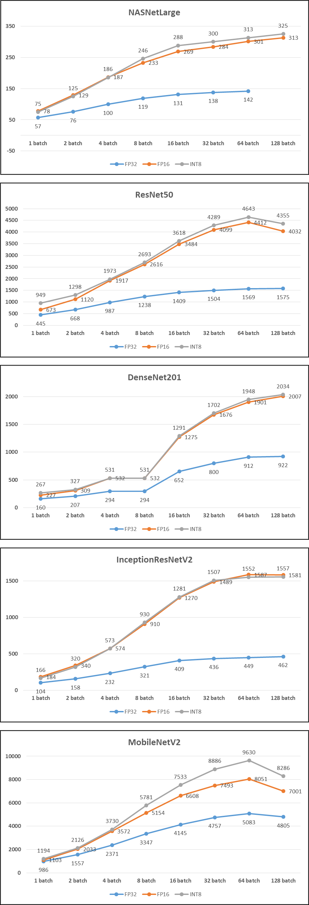

# TensorRT Tutorial
- [TensorRT](https://docs.nvidia.com/deeplearning/tensorrt/install-guide/index.html#overview) : TensorRT는 NVIDIA 그래픽 처리 장치 (GPU)에서 고성능 추론을 용이하게하는 C ++ 라이브러리입니다. 네트워크에 대한 추론을 수행하는 고도로 최적화 된 런타임 엔진을 생성합니다.

  

## 1) 실험내용
- TesorRT를 이용하여 모델의 정밀도를 FP32(floating point 32bit, default), FP16, INT8로 압축하여 모델 별 처리속도 및 정확도 감소 정도를 비교
- 실험 모델은 DenseNet201, InceptionV2, MobileNetV2, NASNetLarge, ResNet50 총 5가지 모델로 테스트
- 모델의 정확도 검증을 위한 데이터 셋으로는 ILSVRC2012 Validation 데이터셋(50000장)을 사용
- 모델의 처리량(속도) 측정은 배치사이즈를 변경하여 각 배치별 초당 처리 이미지 수로 측정

 

## 2) 소스코드 실행방법
- [tensorRT 설치방법](https://docs.nvidia.com/deeplearning/tensorrt/install-guide/index.html#installing) 
- 1). 각 모델의 정밀도 변환 (./scripts/run_model_converter.sh 실행)
- 2). 변환 된 모델의 처리량 측정 (./scripts/run_benchmark.sh 실행)
- 3). 행환 된 모델의 정확도 변화 측정(./scripts/run_validation.sh 실행)

 

## 3) 결과
- 정확도 변화 측정
  
| | FP32 | FP16 | INT8 |
|:---:|:---:|:---:| :---:|
| DenseNet201 | 74.5% | 74.5% | 73.0% |
| InceptionResNetV 2 | 79.1% | 79.1% | 79.2% |
| MobileNetV2 | 68.1% | 68.1% | 67.3%|
| NASNetLarge | 81.6% | 81.6% | 81.5% |
| ResNet50 | 68.1% | 68.1% | 68.1% |
 

- 배치사이즈에 따른 모델 별 처리량 변화(NASNet Large 모델의 128batch의 경우 GPU 메모리 부족으로 측정하지 못함)

- 결론 : 정밀도 축소 결과 성능저하 보다 분류 속도 향상에 더 도움 됨